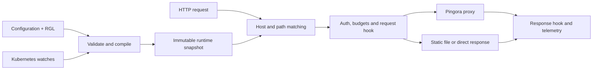

<p align="center">
  
</p>

<p align="center"><strong>NGINX-style configuration. Lua-style routing. Compiled execution.</strong></p>

<p align="center">
  <a href="https://github.com/SamuelSupe/rgnix/actions/workflows/ci.yml"></a>
  <a href="https://github.com/SamuelSupe/rgnix/releases"></a>
  <a href="LICENSE"></a>
  <a href="Cargo.toml"></a>
</p>

<p align="center">
  <b>English</b> · <a href="README.zh-CN.md">简体中文</a><br>
  <a href="#quick-start">Quick start</a> · <a href="#programmable-routing">Routing</a> · <a href="#kubernetes-ingress">Kubernetes</a> · <a href="#logs-and-observability">Observability</a> · <a href="#validation">Validation</a>
</p>

**rgnix** is a Rust HTTP server, reverse proxy, and Kubernetes Ingress controller in one binary. [Pingora](https://github.com/cloudflare/pingora) and OpenSSL handle transport. **RGL**, a small Lua-style language, compiles to WebAssembly and then to native code through Wasmtime/Cranelift when configuration is loaded.

> **v0.2.0 preview** adds request-body routing, OTLP logs/traces, file rotation, traffic and authentication policies, namespace governance, and staged releases. [Download](https://github.com/SamuelSupe/rgnix/releases/tag/v0.2.0) · [Changelog](CHANGELOG.md). Runtime validation covers Linux arm64; see the [validation scope](#validation) and [NGINX compatibility matrix](docs/compatibility.md) before deployment.

## What you get

| Area | Capabilities |
| :--- | :--- |
| **HTTP & proxy** | HTTP/1.1, HTTPS, client/upstream HTTP/2, h2c, gRPC duplex streams and trailers, WebSocket, SSE, streaming bodies |
| **Configuration** | A documented NGINX subset, strict diagnostics, header inheritance, URI replacement, atomic reloads |
| **Compiled routing** | Typed RGL, request/response hooks, JSON/query/cookie/claim helpers, bounded full-body or prefix inspection |
| **Traffic & security** | Trusted real IP and PROXY v1/v2, CIDR ACLs, JWT/JWKS, external auth, client/upstream mTLS, rate and concurrency limits |
| **Backends** | Weighted round robin, least connections, weighted hashing, affinity cookies, active/passive health checks, DNS TTL refresh |
| **Static & TLS** | Root/alias, index, conditional and single-range requests, restricted SPA fallback, gzip/Brotli, SNI certificate reload and expiry metrics |
| **Kubernetes** | Standard Ingress, EndpointSlice IPv4/IPv6 discovery, HTTP/HTTPS backends, TLS Secrets, ConfigMap plugins, durable recovery |
| **Tenant governance** | Administrator quotas and domain grants, namespace-scoped watches/RBAC, named reader/writer identities and audit logs |
| **Release management** | Service weights, bounded mirrors, stable cohorts, staged canaries, approvals, metric gates, automatic error/latency rollback |
| **Operations** | OTLP logs/traces, local log rotation, Prometheus metrics, simulation, candidate diff/preflight, optional admission webhook, persistent standalone rollback |

## Quick start

### Linux arm64 download

Download **rgnix-0.2.0-linux-arm64.tar.gz** and **SHA256SUMS** from [v0.2.0](https://github.com/SamuelSupe/rgnix/releases/tag/v0.2.0). The release also provides a Helm chart; check the checksum for the archive you downloaded:

```sh
grep ' rgnix-0.2.0-linux-arm64.tar.gz$' SHA256SUMS | sha256sum -c -
tar -xzf rgnix-0.2.0-linux-arm64.tar.gz
cd rgnix-0.2.0-linux-arm64
./rgnix check -c examples/nginx.conf
./rgnix serve -c examples/nginx.conf
```

In another terminal, run `curl http://localhost:8080/health` or open `http://localhost:8080/`. Read [runtime requirements](docs/install-binary.md) for glibc-based Linux. The example's `/api/` expects application upstreams on ports **9001–9003**. Relative paths resolve against the main configuration file's directory.

### Build from source or Docker

Use **Rust 1.90+** on Linux. `Cargo.lock` pins dependencies; Docker and CI use Rust 1.98.0.

```sh
git clone --branch v0.2.0 https://github.com/SamuelSupe/rgnix.git
cd rgnix
# Debian / Ubuntu; install Rust separately.
sudo apt-get update
sudo apt-get install -y build-essential cmake pkg-config libssl-dev
cargo build --release --locked
./target/release/rgnix serve -c examples/nginx.conf
```

```sh
docker build -t rgnix:0.2.0 .
docker run --rm -p 8080:8080 -v "$PWD/examples:/etc/rgnix:ro" rgnix:0.2.0 serve -c /etc/rgnix/nginx.conf
```

The image runs as non-root. **Container images are built by users; this release does not publish a registry image.** [Deployment instructions](docs/deployment.md) include linux/amd64 and linux/arm64 build configuration.

## Programmable routing

Attach `.rgl` source or compiled `.wasm` with `rgnix_script`:

```nginx
events {}
http {
    upstream app { server 127.0.0.1:9001; }
    upstream canary { server 127.0.0.1:9002; }
    server {
        listen 8080;
        server_name app.example.com;
        location /api/ {
            proxy_pass http://app/;
            rgnix_script routes.rgl;
        }
    }
}
```

```lua
-- routes.rgl
function on_request()
    if req.header("x-canary") == "1" then
        return route.proxy("canary")
    end
    return route.pass()
end

function on_response()
    resp.set_header("x-proxy", "rgnix")
end
```

`route.pass()` uses the matched action and `proxy_pass` URI replacement. `route.proxy()` selects an allowed backend and preserves the request URI. `req.set_path()` sets the final path without rematching the location. A latched rollout rollback takes precedence over a script's backend choice.

Each request has its own Wasm instance, with defaults of **100,000 fuel per hook**, **8 MiB Wasm memory** and **1 MiB cumulative host data**. Host changes commit only after a successful hook. No WASI, filesystem, network or process APIs are exposed. RGL is an independent language; it does not run arbitrary Lua modules. [Language and API reference](docs/rgl.md).

### Route by POST body, including a truncated prefix

| Inspection policy | Example decision | Forwarding |
| :--- | :--- | :--- |
| `rgnix_request_body full 64k;` | `req.json_string("/tenant") == "vip"` | Buffer within the configured limit, then forward the complete body |
| `rgnix_request_body prefix 4k;` | `req.body_contains("route=vip;")` | Inspect only the first 4096 bytes, then forward those bytes and the remaining stream |

Truncation affects only the plugin's decision input. **The original request body is forwarded in full, once.** Inspection is opt-in, bounded by size/time/concurrency limits, and available in both standalone and Ingress modes. [Body API](docs/request-body.md) · [Runnable example](examples/body-routing.conf).

## Kubernetes Ingress

Build an image and push it to a registry your cluster can pull from:

```sh
docker build -t YOUR_REGISTRY/rgnix:0.2.0 .
docker push YOUR_REGISTRY/rgnix:0.2.0
helm upgrade --install rgnix charts/rgnix --namespace rgnix-system --create-namespace --set image.repository=YOUR_REGISTRY/rgnix --set image.tag=0.2.0
kubectl -n rgnix-system rollout status deployment/rgnix
```

The chart defaults to **two replicas** and includes an IngressClass, RBAC, Service, probes, PDB and graceful termination. No custom CRD is required. Prepare application Services and TLS Secrets before applying the [Ingress example](examples/ingress.yaml).

- Exact/wildcard hosts, default backends, named/numeric Service ports, and Kubernetes `Exact`/`Prefix` paths; `ImplementationSpecific` uses Prefix semantics.
- Ready, non-terminating IPv4/IPv6 endpoints; an empty backend returns 503. HTTPS/private CA and HTTP/2 policies are available through [Ingress annotations](examples/ingress-policies.yaml).
- Same-namespace ConfigMap plugins via `rgnix.io/script: routes/main.rgl`; scripts may select only that Ingress's declared backends.
- Durable accepted configuration in controller-namespace ConfigMaps. Invalid plugin updates retain the last accepted version while resource deletion and endpoint withdrawal still take effect.

### Tenant boundaries and staged releases

Administrators can restrict watched namespaces, authorize domains, and cap configuration size, routes, requests, plugins, auth and mirrors per namespace. Named reader/writer identities constrain management access by namespace; credentials and policy files reload atomically. [Governance guide](docs/governance.md) · [Quota and change-management guide](docs/platform-policies.md).

Configure a **90/10 Service split** with an annotation:

```yaml
metadata:
  annotations:
    rgnix.io/traffic-policy: >-
      {"revision":"checkout-v2",
       "backends":[{"service":"checkout-stable:http","weight":90},
                   {"service":"checkout-canary:http","weight":10}]}
```

The [complete rollout example](examples/ingress-rollout.yaml) adds stable cohorts, mirrors, stages, approvals and error/p95 rollback. External JSON metric gates block promotion when unhealthy or unavailable; local error/latency rules trigger automatic rollback. Progress persists across controller restarts. File diff, candidate preflight and an optional TLS admission webhook validate changes before publication.

**Quota counters are per process**, not distributed quotas or separate cgroups. For hard CPU/memory isolation, use separate controller Deployments/IngressClasses, scoped watches and Kubernetes resource limits.

## Logs and observability

Export access logs to an OpenTelemetry Collector or another OTLP/HTTP protobuf endpoint:

```sh
OTEL_SERVICE_NAME=rgnix-edge OTEL_EXPORTER_OTLP_LOGS_ENDPOINT=http://collector:4318/v1/logs rgnix serve -c examples/nginx.conf
```

OTLP supports authentication headers, HTTPS/private CAs, bounded asynchronous queues, drop metrics and shutdown flushing. Optional server/client traces correlate with access logs. Ingress uses the same exporter and supports credentials from a Helm Secret. [OTLP guide](docs/otlp.md).

Local logs can rotate by size or UTC interval with retention and gzip:

```nginx
http {
    access_log /var/log/rgnix/access.log;
    error_log /var/log/rgnix/error.log warn;
    rgnix_log_rotation size=100m interval=1d keep=7 gzip=on;
    # Add server blocks here; create a writable log directory first.
}
```

File and OTLP logging can run together. **SIGUSR1** reopens files for external logrotate. [Rotation guide](docs/log-rotation.md) · [Example](examples/logging.conf).

The separate management listener exposes `/healthz`, `/readyz` and `/metrics`. These endpoints are unauthenticated and should remain on a protected management network. Token-protected `/v1/*` APIs expose configuration, routing, simulation, release controls and history. [Operations and metrics](docs/deployment.md).

## CLI and architecture

```text
rgnix serve -c nginx.conf [--admin 127.0.0.1:9090] [--threads 2]
rgnix check -c nginx.conf
rgnix compile routes.rgl -o routes.wasm
rgnix dump -c nginx.conf
rgnix diff -c candidate.conf --against nginx.conf
rgnix explain -c nginx.conf --host example.com --path /api
rgnix simulate -c nginx.conf --request request.json
rgnix ingress --ingress-class rgnix --publish-service namespace/service
```

`check` validates configuration, DNS, certificates and plugins without opening listeners. `compile` produces portable Wasm. **SIGHUP** reloads standalone routes, scripts, certificates and log policy; **SIGTERM** drains requests. Listener and worker-thread changes require restart.



Compilation occurs on the control plane. Snapshot publication is atomic; in-flight requests retain their original version. Simulation shows the outbound plan without sending a business request or changing live counters.

## Validation

The **v0.2.0 release binary** passed the HTTP, policy, recovery, logging and NGINX suites below on **OrbStack Linux arm64**, plus nine real Kubernetes upgrade checks. Both ready Pods run the same binary as the download. [Release evidence and hashes](docs/validation-release-0.2.0.md). Local acceptance evidence is separate from the GitHub Actions badge.

| v0.2.0 release checks | Result |
| :--- | ---: |
| Rust tests / fmt / Clippy | **7/7**, checks passed |
| HTTP / TLS / streaming / plugins | **79/79** |
| Standalone product policies | **89/89** |
| NGINX 1.28.0 differential checks | **46/46** |
| Kubernetes API fault / recovery | **53/53** |
| OTLP / file rotation | **32/32**, **20/20** |
| Real Kubernetes upgrade, admission and Class checks | **9/9** |

Earlier full Kubernetes lifecycle (**46/46**), governance (**65/65**) and rolling traffic (**300/300**) results remain in the [governance record](docs/validation-governance.md), with their exact QA artifact identities. These broader suites were not rerun for the version-only release build.

**Not yet validated:** amd64 runtime acceptance, multiple nodes, cloud load balancers, long-duration load and adversarial tenant capacity limits. Multi-architecture build configuration does not establish equivalent runtime coverage. Prior performance measurements are historical, not a v0.2 capacity guarantee.

## Scope and documentation

rgnix implements an explicit NGINX subset. It does not implement full Lua/NGINX compatibility, regex/nested locations, `rewrite/map/if`, response caching, HTTP/3, Gateway API, ingress-nginx annotations, distributed rate limiting or automatic business-request retries. Unsupported configuration fails with diagnostics.

| Guide | Contents |
| :--- | :--- |
| [Compatibility](docs/compatibility.md) | Directives, inheritance, variables and intentional differences |
| [RGL](docs/rgl.md) · [Body routing](docs/request-body.md) | Language, host APIs, ABI, sandbox and inspection limits |
| [Traffic policies](docs/product-features.md) | Authentication, load balancing, static serving, compression and traces |
| [Governance](docs/governance.md) · [Platform policies](docs/platform-policies.md) | Domains, quotas, roles, staged releases, preflight, admission and rollback |
| [Operations](docs/deployment.md) | Helm, TLS, recovery, metrics and shutdown |
| [OTLP](docs/otlp.md) · [File logs](docs/log-rotation.md) | Export, rotation and delivery limits |
| [Validation](docs/validation-release-0.2.0.md) · [Contributing](CONTRIBUTING.md) | Evidence, reproduction and development checks |

Most detailed references and validation reports are currently in Chinese. [简体中文 README](README.zh-CN.md).

## License

[Apache License 2.0](LICENSE). The bounded Pingora modifications and upstream provenance are documented in [vendor/README.md](vendor/README.md).
