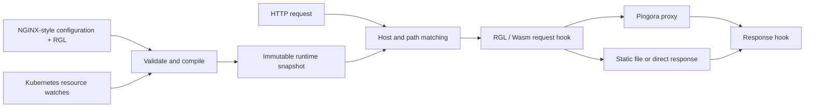

<p align="center">
  
</p>

<p align="center"><strong>NGINX-style configuration. Lua-style routing. Compiled execution.</strong></p>

<p align="center">
  <a href="https://github.com/SamuelSupe/rgnix/actions/workflows/ci.yml"></a>
  <a href="https://github.com/SamuelSupe/rgnix/releases"></a>
  <a href="LICENSE"></a>
  <a href="Cargo.toml"></a>
</p>

<p align="center">
  <b>English</b> · <a href="README.zh-CN.md">简体中文</a><br>
  <a href="#quick-start">Quick start</a> · <a href="#programmable-routing">Routing</a> · <a href="#kubernetes-ingress">Kubernetes</a> · <a href="#validation">Validation</a> · <a href="https://github.com/SamuelSupe/rgnix/releases">Downloads</a>
</p>

**rgnix** is a Rust HTTP server, reverse proxy, and Kubernetes Ingress controller in one binary. [Pingora](https://github.com/cloudflare/pingora) and OpenSSL handle HTTP and proxy transport. **RGL**, a small Lua-style language, compiles to WebAssembly and then to native code through Wasmtime/Cranelift when configuration is loaded.

> **v0.1 preview.** Linux arm64 has runtime acceptance evidence. NGINX compatibility is an explicit subset; RGL is its own language. See the [compatibility matrix](docs/compatibility.md) before migrating a configuration. Detailed reference and validation documents are currently in Chinese.

## What you get

| Area | Capabilities |
| :--- | :--- |
| **HTTP & proxy** | HTTP/1.1, HTTPS, client HTTP/2, WebSocket, SSE, streaming bodies, weighted round-robin, connection reuse and timeouts |
| **Familiar configuration** | `http`, `server`, `upstream`, prefix/exact `location`, `proxy_pass`, request variables, header inheritance and `include` |
| **Compiled routing** | Typed RGL functions and branches, request/response hooks, `.rgl` or `.wasm` loading, fuel and memory limits |
| **Static serving & TLS** | GET/HEAD, index files, MIME, conditional requests, single-range responses, root confinement, SNI certificates and reload |
| **Kubernetes** | Standard Ingress, IngressClass, Service and EndpointSlice discovery, TLS Secrets, ConfigMap plugins, Lease-based status updates |
| **Operations** | Atomic configuration snapshots, graceful shutdown, `/healthz`, `/readyz`, `/metrics`, access/error logs and a two-replica Helm chart |

## Quick start

Build on Linux with **Rust 1.90+** and the native dependencies below. Dependencies are locked in `Cargo.lock`; the supplied Docker build and CI use Rust 1.98.0.

```sh
git clone https://github.com/SamuelSupe/rgnix.git
cd rgnix

# Debian / Ubuntu — install Rust separately if needed
sudo apt-get update
sudo apt-get install -y build-essential cmake pkg-config libssl-dev openssl curl python3
cargo build --release --locked

./target/release/rgnix check -c examples/nginx.conf
./target/release/rgnix serve -c examples/nginx.conf
```

In another terminal:

```sh
curl http://localhost:8080/
curl http://localhost:8080/health
curl http://127.0.0.1:9090/readyz
```

The example serves a static page and `/health` immediately. Its `/api/` proxy expects your upstreams on ports **9001–9003**. Relative paths resolve against the main configuration file's directory.

Prebuilt **Linux arm64** archives are available in [Releases](https://github.com/SamuelSupe/rgnix/releases). They target glibc-based Linux; see the included `INSTALL.md` for runtime requirements and verify the download with `SHA256SUMS`.

### Run with Docker

```sh
docker build -t rgnix:0.1.0 .
docker run --rm -p 8080:8080 \
  -v "$PWD/examples:/etc/rgnix:ro" \
  rgnix:0.1.0 serve -c /etc/rgnix/nginx.conf
```

The image runs as a non-root user. Build your own image: there is currently no published container image. See [deployment documentation](docs/deployment.md) for multi-architecture builds and runtime settings.

## Programmable routing

Attach a script to a server or location using `rgnix_script`. This example can send a request to a canary backend based on a header.

**`nginx.conf`**

```nginx
events {}
http {
    upstream app {
        server 127.0.0.1:9001 weight=2;
        server 127.0.0.1:9002;
    }
    upstream canary { server 127.0.0.1:9003; }

    server {
        listen 8080;
        server_name app.example.com;

        location /api/ {
            proxy_pass http://app/;
            proxy_set_header Host $host;
            rgnix_script routes.rgl;
        }
    }
}
```

**`routes.rgl`**

```lua
function on_request()
    if req.header("x-canary") == "1" then
        return route.proxy("canary")
    end
    return route.pass()
end

function on_response()
    resp.set_header("x-proxy", "rgnix")
end
```

`route.pass()` uses the location's action and `proxy_pass` URI replacement. `route.proxy()` selects an allowed backend and preserves the request URI. Use `req.set_path()` to set the final path explicitly; it does not rematch the location.

Each request has its own Wasm instance, with **100,000 fuel per hook**, **8 MiB Wasm memory**, and **1 MiB cumulative host data** by default. Host changes are staged until the hook succeeds. There is no WASI, filesystem, network, or process API. Each request hook may call only one routing decision API; HTTPS backend aliases retain TLS verification, and ambiguous HTTP/HTTPS aliases are rejected at load time.

→ [Language, host API and ABI reference](docs/rgl.md)

## How it works



Compilation happens on the control plane. File reloads atomically publish a new snapshot; in-flight requests retain their original version. Ingress plugin failures preserve that resource's last accepted configuration while deletions, endpoint withdrawal, and TLS changes continue to take effect.

## Kubernetes Ingress

Build and push an image to a registry your cluster can pull from, then install the chart:

```sh
docker build -t YOUR_REGISTRY/rgnix:0.1.0 .
docker push YOUR_REGISTRY/rgnix:0.1.0

helm upgrade --install rgnix charts/rgnix \
  --namespace rgnix-system --create-namespace \
  --set image.repository=YOUR_REGISTRY/rgnix \
  --set image.tag=0.1.0
kubectl -n rgnix-system rollout status deployment/rgnix
```

The chart includes **two replicas**, RBAC, an IngressClass, a Service, probes, a PodDisruptionBudget, and graceful termination. No custom CRD is required.

- Supports exact/wildcard hosts, default backends, named/numeric Service ports, and `Exact`/`Prefix` paths. `ImplementationSpecific` uses Prefix semantics.
- Discovers ready, non-terminating IPv4/IPv6 EndpointSlice addresses; no available endpoints returns 503.
- Loads same-namespace plugins with `rgnix.io/script: routes/main.rgl`. A plugin may select only backends declared by its Ingress.
- Persists accepted plugin source and routes in controller-namespace ConfigMaps so new replicas can recover during invalid updates.

Prepare the application Services and TLS Secret before applying [the Ingress example](examples/ingress.yaml). Ingress backends currently use HTTP; HTTPS upstreams are available in standalone mode.

→ [Deployment, configuration recovery, TLS and operational limits](docs/deployment.md)

## CLI

```text
rgnix serve -c nginx.conf [--admin 127.0.0.1:9090] [--threads 2]
rgnix check -c nginx.conf
rgnix compile routes.rgl -o routes.wasm
rgnix ingress --ingress-class rgnix --publish-service namespace/service
```

`check` validates configuration, resolves upstream DNS, reads certificates, and compiles/instantiates plugins without opening listeners. `compile` produces portable Wasm. Send **SIGHUP** to reload standalone routes, plugins, and certificates; **SIGTERM** starts graceful shutdown. Listener or worker-thread changes require a restart.

## Validation

The latest recorded acceptance run uses **qa14 on OrbStack Ubuntu Linux arm64**, completed September 25, 2026. These are recorded local acceptance results, separate from the live CI badge above.

| Suite | Result |
| :--- | ---: |
| Rust unit tests, fmt and Clippy | **5/5**, checks passed |
| HTTP / TLS / proxy / plugin regression | **59/59** |
| Differential checks against NGINX 1.28.0 | **46/46** |
| Kubernetes API fault and recovery scenarios | **39/39** |
| Real Kubernetes lifecycle scenarios | **41/41** |
| Requests during a two-replica rolling upgrade | **300/300** |

[Full validation record](docs/validation-semantics.md) · [Artifact hashes](docs/validation/semantics-artifact.json) · [Changelog](CHANGELOG.md)

**Remaining validation:** amd64 runtime acceptance, multiple nodes, cloud load balancers, and long-duration load tests. Multi-architecture build configuration is provided; it does not establish equivalent runtime coverage.

## Scope and documentation

v0.1 does not implement full Lua or NGINX compatibility, regex/nested locations, `rewrite`, `map`, `if`, `try_files`, caching, Gateway API, ingress-nginx annotations, active health checks, or automatic request retries. Unsupported directives fail with diagnostics.

| Guide | Contents |
| :--- | :--- |
| [Compatibility matrix](docs/compatibility.md) | Directives, inheritance, request variables and intentional differences |
| [RGL reference](docs/rgl.md) | Syntax, types, hooks, host APIs, ABI and resource limits |
| [Operations guide](docs/deployment.md) | TLS, Helm, reloads, recovery, metrics and shutdown |
| [Validation history](docs/validation-semantics.md) | Reproduction steps, regression evidence and links to earlier rounds |
| [Contributing](CONTRIBUTING.md) | Local checks and useful bug reports |

## License

[Apache License 2.0](LICENSE).
