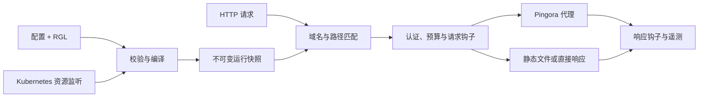

<p align="center">
  
</p>

<p align="center"><strong>NGINX 风格配置 · Lua 风格路由 · 编译执行</strong></p>

<p align="center">
  <a href="https://github.com/SamuelSupe/rgnix/actions/workflows/ci.yml"></a>
  <a href="https://github.com/SamuelSupe/rgnix/releases"></a>
  <a href="LICENSE"></a>
  <a href="Cargo.toml"></a>
</p>

<p align="center">
  <a href="README.md">English</a> · <b>简体中文</b><br>
  <a href="#快速运行">快速运行</a> · <a href="#编程式路由">路由插件</a> · <a href="#kubernetes-ingress">Kubernetes</a> · <a href="#日志与可观测性">可观测性</a> · <a href="#实际验证">实际验证</a>
</p>

**rgnix** 将 HTTP 服务、反向代理和 Kubernetes Ingress controller 放进一个 Rust 二进制。数据面基于 [Pingora](https://github.com/cloudflare/pingora) 与 OpenSSL；内置 Lua 风格语言 **RGL → WebAssembly → Wasmtime/Cranelift 机器码**，在加载配置时完成编译。

> **v0.2.0 预览版**新增请求体路由、OTLP 日志与链路、本地日志轮转、流量与认证策略、多租户治理和分阶段灰度发布。[下载](https://github.com/SamuelSupe/rgnix/releases/tag/v0.2.0) · [更新记录](CHANGELOG.md)。运行验收覆盖 Linux arm64，部署前请查看[验证范围](#实际验证)和 [NGINX 兼容矩阵](docs/compatibility.md)。

## 主要能力

| 领域 | 已实现能力 |
| :--- | :--- |
| **HTTP 与代理** | HTTP/1.1、HTTPS、客户端/上游 HTTP/2、h2c、gRPC 双向流与 trailers、WebSocket、SSE、流式请求体 |
| **配置** | 有明确边界的 NGINX 子集、严格诊断、头部继承、URI 替换、原子热更新 |
| **编译式路由** | 有类型的 RGL、请求/响应钩子、JSON/query/Cookie/claim API、受限完整 Body 或前缀读取 |
| **流量与安全** | 可信真实 IP、PROXY v1/v2、CIDR ACL、JWT/JWKS、外部认证、客户端/上游 mTLS、限流与并发预算 |
| **后端调度** | 加权轮询、最少连接、加权哈希、黏性 Cookie、主动/被动健康检查、DNS TTL 更新 |
| **静态文件与 TLS** | root/alias、索引、条件请求、单段 Range、受限 SPA fallback、gzip/Brotli、SNI 证书热更新与到期指标 |
| **Kubernetes** | 标准 Ingress、EndpointSlice IPv4/IPv6、HTTP/HTTPS 后端、TLS Secret、ConfigMap 插件、持久恢复 |
| **多租户治理** | 管理员配额与域名授权、限定 namespace 的 watch/RBAC、具名读写身份与操作审计 |
| **发布管理** | Service 权重、受限镜像流量、稳定分组、分阶段灰度、审批、指标门禁、错误率/时延自动回退 |
| **运维** | OTLP 日志/链路、本地日志轮转、Prometheus 指标、模拟、配置 diff/预检、可选准入 Webhook、持久化历史回退 |

## 快速运行

### 下载 Linux arm64 版本

从 [v0.2.0 Release](https://github.com/SamuelSupe/rgnix/releases/tag/v0.2.0) 下载 **rgnix-0.2.0-linux-arm64.tar.gz** 与 **SHA256SUMS**。同一 Release 还提供 Helm Chart；下面只校验已下载的二进制包：

```sh
grep ' rgnix-0.2.0-linux-arm64.tar.gz$' SHA256SUMS | sha256sum -c -
tar -xzf rgnix-0.2.0-linux-arm64.tar.gz
cd rgnix-0.2.0-linux-arm64
./rgnix check -c examples/nginx.conf
./rgnix serve -c examples/nginx.conf
```

另开终端执行 `curl http://localhost:8080/health`，或访问 `http://localhost:8080/`。下载包适用于基于 glibc 的 Linux，详见[运行依赖](docs/install-binary.md)。示例 `/api/` 需要自行启动 **9001–9003** 端口上的应用上游；相对路径以主配置文件目录为基准。

### 从源码或 Docker 构建

在 Linux 上使用 **Rust 1.90+**。依赖锁定在 `Cargo.lock`，Docker 与 CI 使用 Rust 1.98.0。

```sh
git clone --branch v0.2.0 https://github.com/SamuelSupe/rgnix.git
cd rgnix
# Debian / Ubuntu；Rust 需单独安装。
sudo apt-get update
sudo apt-get install -y build-essential cmake pkg-config libssl-dev
cargo build --release --locked
./target/release/rgnix serve -c examples/nginx.conf
```

```sh
docker build -t rgnix:0.2.0 .
docker run --rm -p 8080:8080 -v "$PWD/examples:/etc/rgnix:ro" rgnix:0.2.0 serve -c /etc/rgnix/nginx.conf
```

镜像以非 root 用户运行。**本次发布不提供公共 registry 镜像，需自行构建。** [部署文档](docs/deployment.md)提供 linux/amd64 与 linux/arm64 镜像构建配置。

## 编程式路由

通过 `rgnix_script` 挂载 `.rgl` 源码或已编译的 `.wasm`：

```nginx
events {}
http {
    upstream app { server 127.0.0.1:9001; }
    upstream canary { server 127.0.0.1:9002; }
    server {
        listen 8080;
        server_name app.example.com;
        location /api/ {
            proxy_pass http://app/;
            rgnix_script routes.rgl;
        }
    }
}
```

```lua
-- routes.rgl
function on_request()
    if req.header("x-canary") == "1" then
        return route.proxy("canary")
    end
    return route.pass()
end

function on_response()
    resp.set_header("x-proxy", "rgnix")
end
```

`route.pass()` 使用匹配动作和 `proxy_pass` 的 URI 替换规则；`route.proxy()` 选择获准后端并保留请求 URI。`req.set_path()` 设置最终路径，不重新匹配 location。已锁定的灰度回退优先于脚本选择的后端。

每个请求独享 Wasm 实例，默认限制为**每次钩子 10 万 fuel、8 MiB Wasm 内存、1 MiB 累计宿主数据**。宿主修改仅在钩子成功后提交；不开放 WASI、文件、网络或进程 API。RGL 是独立语言，不能直接运行任意 Lua 模块。详见[语言与 API](docs/rgl.md)。

### 按 POST Body 路由，支持截断读取前缀

| 检查策略 | 判断示例 | 转发行为 |
| :--- | :--- | :--- |
| `rgnix_request_body full 64k;` | `req.json_string("/tenant") == "vip"` | 在配置上限内缓冲，再转发完整请求体 |
| `rgnix_request_body prefix 4k;` | `req.body_contains("route=vip;")` | 只检查前 4096 字节，随后转发已读字节和剩余数据流 |

截断只影响插件用于判断的输入。**上游仍收到完整原始请求体，且只转发一次。** 读取需显式开启，受大小、时间和并发预算约束；独立服务和 Ingress 均支持。[Body API](docs/request-body.md) · [可运行示例](examples/body-routing.conf)。

## Kubernetes Ingress

构建镜像并推送到集群可以拉取的仓库：

```sh
docker build -t YOUR_REGISTRY/rgnix:0.2.0 .
docker push YOUR_REGISTRY/rgnix:0.2.0
helm upgrade --install rgnix charts/rgnix --namespace rgnix-system --create-namespace --set image.repository=YOUR_REGISTRY/rgnix --set image.tag=0.2.0
kubectl -n rgnix-system rollout status deployment/rgnix
```

Chart 默认部署**两个副本**，包含 IngressClass、RBAC、Service、探针、PDB 与优雅终止，无需自定义 CRD。先准备应用 Service 与 TLS Secret，再应用 [Ingress 示例](examples/ingress.yaml)。

- 支持精确/通配域名、默认后端、命名/数字 Service 端口以及 Kubernetes `Exact`/`Prefix` 路径；`ImplementationSpecific` 定义为 Prefix。
- 使用就绪且未终止的 IPv4/IPv6 端点；无端点返回 503。通过 [Ingress 策略](examples/ingress-policies.yaml)配置 HTTPS/私有 CA 和 HTTP/2。
- 通过 `rgnix.io/script: routes/main.rgl` 引用同 namespace 的 ConfigMap 插件；脚本仅能选择当前 Ingress 声明的后端。
- 在控制器 namespace 的 ConfigMap 中保存已接受配置。坏插件更新保留上一有效版本，资源删除和端点撤销仍然生效。

### 租户边界与分阶段发布

管理员可以限制 watch 范围、授权域名，并按 namespace 限制配置大小、路由、请求、插件、外部认证及镜像流量。具名 reader/writer 身份限定可管理的 namespace；凭证与策略文件原子热更新。[治理指南](docs/governance.md) · [配额与变更管理](docs/platform-policies.zh-CN.md)。

通过注解声明 **90/10 Service 分流**：

```yaml
metadata:
  annotations:
    rgnix.io/traffic-policy: >-
      {"revision":"checkout-v2",
       "backends":[{"service":"checkout-stable:http","weight":90},
                   {"service":"checkout-canary:http","weight":10}]}
```

[完整灰度示例](examples/ingress-rollout.yaml)包含稳定分组、流量镜像、阶段权重、审批及错误率/p95 回退。外部 JSON 指标门禁在指标异常或不可用时阻止推进；本地错误率/时延规则触发自动回退。发布进度跨控制器重启保留。文件 diff、候选预检和可选 TLS 准入 Webhook 在发布前校验变更。

**配额按进程计数**，不提供跨副本精确配额或独立 cgroup。硬 CPU/内存隔离应使用独立控制器 Deployment/IngressClass、限定 watch 与 Kubernetes 资源限制。

## 日志与可观测性

将访问日志发送到 OpenTelemetry Collector 或支持 OTLP/HTTP protobuf 的第三方平台：

```sh
OTEL_SERVICE_NAME=rgnix-edge OTEL_EXPORTER_OTLP_LOGS_ENDPOINT=http://collector:4318/v1/logs rgnix serve -c examples/nginx.conf
```

支持认证头、HTTPS/私有 CA、后台有界队列、丢弃指标及退出刷新。可选 server/client traces 与访问日志关联。Ingress 使用同一 exporter，并支持从 Helm Secret 读取凭证。[OTLP 指南](docs/otlp.md)。

本地日志可以按大小或 UTC 时间轮转，设置保留份数与 gzip：

```nginx
http {
    access_log /var/log/rgnix/access.log;
    error_log /var/log/rgnix/error.log warn;
    rgnix_log_rotation size=100m interval=1d keep=7 gzip=on;
    # 添加 server 配置；预先创建可写日志目录。
}
```

本地日志与 OTLP 可以同时启用。使用 **SIGUSR1** 重开文件，配合外部 logrotate。[轮转指南](docs/log-rotation.md) · [可运行示例](examples/logging.conf)。

独立管理端口提供 `/healthz`、`/readyz` 和 `/metrics`，这些接口无需认证，应部署在受保护的管理网络。`/v1/*` 管理接口需要 token，可用于查看配置、解释路由、模拟、发布控制和历史回退。[运维与指标](docs/deployment.md)。

## CLI 与运行架构

```text
rgnix serve -c nginx.conf [--admin 127.0.0.1:9090] [--threads 2]
rgnix check -c nginx.conf
rgnix compile routes.rgl -o routes.wasm
rgnix dump -c nginx.conf
rgnix diff -c candidate.conf --against nginx.conf
rgnix explain -c nginx.conf --host example.com --path /api
rgnix simulate -c nginx.conf --request request.json
rgnix ingress --ingress-class rgnix --publish-service namespace/service
```

`check` 完成配置、DNS、证书和插件校验，不启动监听；`compile` 输出可移植 Wasm。**SIGHUP** 热更新独立服务的路由、脚本、证书和日志策略；**SIGTERM** 优雅终止。监听参数和工作线程变化需要重启。



编译仅发生在控制面。快照原子发布，在途请求保留原版本；模拟器展示最终转发计划，不发送业务请求，也不修改真实计数器。

## 实际验证

**v0.2.0 发布二进制**在 **OrbStack Linux arm64** 通过下表 HTTP、策略、恢复、日志及 NGINX 回归，以及 9 项真实 Kubernetes 升级检查。两个就绪 Pod 的二进制与下载包一致。[发布证据与摘要](docs/validation-release-0.2.0.md)。本地验收与 GitHub Actions 徽章分别记录。

| v0.2.0 发布检查 | 结果 |
| :--- | ---: |
| Rust 测试 / fmt / Clippy | **7/7**，检查通过 |
| HTTP / TLS / 流式传输 / 插件 | **79/79** |
| 独立模式产品策略 | **89/89** |
| NGINX 1.28.0 对照 | **46/46** |
| Kubernetes API 故障 / 恢复 | **53/53** |
| OTLP / 文件轮转 | **32/32**、**20/20** |
| 真实 Kubernetes 升级、准入与 Class 检查 | **9/9** |

此前完整 Kubernetes 生命周期 **46/46**、治理 **65/65** 与滚动请求 **300/300** 的结果保留在[治理记录](docs/validation-governance.md)，并注明对应 QA 产物。本次仅修改生产包版本与元数据，未重跑这些更广的真实集群套件。

**尚未验证：** amd64 运行、多节点、云 LoadBalancer、长期压测和恶意租户容量极限。双架构构建配置不代表两种架构具有相同的运行验收覆盖；已有性能数据属于历史测量，不是 v0.2 的容量保证。

## 范围与文档

rgnix 实现明确的 NGINX 子集，不包含完整 Lua/NGINX 兼容、正则及嵌套 location、`rewrite/map/if`、响应缓存、HTTP/3、Gateway API、ingress-nginx 注解、分布式限流或自动业务请求重试。不支持的配置会给出诊断。

| 文档 | 内容 |
| :--- | :--- |
| [兼容矩阵](docs/compatibility.md) | 指令、继承、变量及兼容差异 |
| [RGL](docs/rgl.md) · [Body 路由](docs/request-body.md) | 语言、宿主 API、ABI、沙箱与读取边界 |
| [流量策略](docs/product-features.md) | 认证、调度、静态文件、压缩和链路 |
| [治理](docs/governance.md) · [平台策略](docs/platform-policies.zh-CN.md) | 域名、配额、身份、灰度、预检、准入与回退 |
| [部署运维](docs/deployment.md) | Helm、TLS、恢复、指标与终止 |
| [OTLP](docs/otlp.md) · [文件日志](docs/log-rotation.md) | 导出、轮转与投递边界 |
| [验证记录](docs/validation-release-0.2.0.md) · [参与开发](CONTRIBUTING.md) | 运行证据、复现方法与开发检查 |

## 许可证

[Apache License 2.0](LICENSE)。Pingora 补丁及上游来源见 [vendor/README.md](vendor/README.md)。
