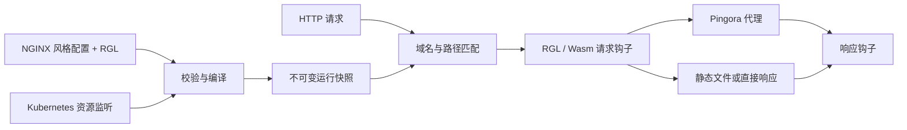

<p align="center">
  
</p>

<p align="center"><strong>NGINX 风格配置 · Lua 风格路由 · 编译执行</strong></p>

<p align="center">
  <a href="https://github.com/SamuelSupe/rgnix/actions/workflows/ci.yml"></a>
  <a href="https://github.com/SamuelSupe/rgnix/releases"></a>
  <a href="LICENSE"></a>
  <a href="Cargo.toml"></a>
</p>

<p align="center">
  <a href="README.md">English</a> · <b>简体中文</b><br>
  <a href="#快速运行">快速运行</a> · <a href="#编程式路由">路由插件</a> · <a href="#kubernetes-ingress">Kubernetes</a> · <a href="#实际验证">实际验证</a> · <a href="https://github.com/SamuelSupe/rgnix/releases">下载</a>
</p>

**rgnix** 将 HTTP 服务、反向代理和 Kubernetes Ingress controller 放进一个 Rust 二进制。数据面基于 [Pingora](https://github.com/cloudflare/pingora) + OpenSSL；内置 Lua 风格语言 **RGL → WebAssembly → Wasmtime/Cranelift 机器码**，在加载配置时完成编译。

> **v0.1 预览版。** 已有 Linux arm64 运行验收证据。NGINX 兼容范围是明确的子集，RGL 是独立语言。迁移配置前请查看[兼容矩阵](docs/compatibility.md)。

## 主要能力

| 领域 | 已实现能力 |
| :--- | :--- |
| **HTTP 与代理** | HTTP/1.1、HTTPS、客户端 HTTP/2、WebSocket、SSE、流式请求与响应、加权轮询、连接复用及超时 |
| **熟悉的配置方式** | `http`、`server`、`upstream`、前缀/精确 `location`、`proxy_pass`、变量、头部继承和 `include` |
| **编译式路由** | 有类型的 RGL 函数与分支，请求/响应钩子，加载 `.rgl` 或 `.wasm`，fuel 与内存限额 |
| **静态文件与 TLS** | GET/HEAD、目录索引、MIME、条件请求、单段 Range、根目录访问限制、SNI 证书与热更新 |
| **Kubernetes** | 标准 Ingress、IngressClass、Service/EndpointSlice 发现、TLS Secret、ConfigMap 插件及 Lease 选主回写 |
| **运行管理** | 不可变配置快照、优雅终止、健康/就绪探针、Prometheus 指标、日志及默认双副本 Helm Chart |

## 快速运行

Linux 源码构建需要 **Rust 1.90+**。依赖已锁定在 `Cargo.lock`；随附 Docker 构建和 CI 使用 Rust 1.98.0。

```sh
git clone https://github.com/SamuelSupe/rgnix.git
cd rgnix

# Debian / Ubuntu；Rust 需预先安装
sudo apt-get update
sudo apt-get install -y build-essential cmake pkg-config libssl-dev openssl curl python3
cargo build --release --locked

./target/release/rgnix check -c examples/nginx.conf
./target/release/rgnix serve -c examples/nginx.conf
```

在另一个终端验证：

```sh
curl http://localhost:8080/
curl http://localhost:8080/health
curl http://127.0.0.1:9090/readyz
```

示例的静态首页和 `/health` 可直接访问；`/api/` 需要自行启动 **9001–9003** 端口上的后端。相对配置路径均以主配置文件所在目录为基准。

[Releases](https://github.com/SamuelSupe/rgnix/releases) 提供面向 glibc Linux 的 **arm64** 预构建压缩包。运行依赖见包内 `INSTALL.md`，下载后请使用发布附件 `SHA256SUMS` 校验。

### 容器运行

```sh
docker build -t rgnix:0.1.0 .
docker run --rm -p 8080:8080 \
  -v "$PWD/examples:/etc/rgnix:ro" \
  rgnix:0.1.0 serve -c /etc/rgnix/nginx.conf
```

镜像以非 root 用户运行。目前未发布公共容器镜像，需要自行构建；双架构构建与运行参数见[部署文档](docs/deployment.md)。

## 编程式路由

通过 `rgnix_script` 在 server 或 location 挂载脚本。下面的配置根据请求头选择 canary 后端。

**`nginx.conf`**

```nginx
events {}
http {
    upstream app {
        server 127.0.0.1:9001 weight=2;
        server 127.0.0.1:9002;
    }
    upstream canary { server 127.0.0.1:9003; }

    server {
        listen 8080;
        server_name app.example.com;

        location /api/ {
            proxy_pass http://app/;
            proxy_set_header Host $host;
            rgnix_script routes.rgl;
        }
    }
}
```

**`routes.rgl`**

```lua
function on_request()
    if req.header("x-canary") == "1" then
        return route.proxy("canary")
    end
    return route.pass()
end

function on_response()
    resp.set_header("x-proxy", "rgnix")
end
```

`route.pass()` 使用 location 原动作及 `proxy_pass` URI 替换规则；`route.proxy()` 选择允许的后端并保留请求 URI。需要固定最终路径时使用 `req.set_path()`，不会重新匹配 location。

每个请求拥有独立 Wasm 实例，默认每次钩子 **100,000 fuel**、**8 MiB Wasm 内存**、**1 MiB 累计宿主数据**。修改暂存至钩子成功后提交；不开放 WASI、文件、网络或进程 API。每次请求钩子最多调用一次路由决策 API；HTTPS 后端别名保留 TLS 验证，含插件的混合 HTTP/HTTPS 同名别名会在加载时被拒绝。

→ [语言、宿主 API 与 ABI 文档](docs/rgl.md)

## 运行架构



编译仅发生在控制面。文件配置通过原子替换发布，在途请求保持原有版本。Ingress 插件更新失败时保留对应资源上一有效配置；删除、端点撤销和 TLS 变化仍然生效。

## Kubernetes Ingress

将镜像推送到集群可拉取的仓库，再安装 Chart：

```sh
docker build -t YOUR_REGISTRY/rgnix:0.1.0 .
docker push YOUR_REGISTRY/rgnix:0.1.0

helm upgrade --install rgnix charts/rgnix \
  --namespace rgnix-system --create-namespace \
  --set image.repository=YOUR_REGISTRY/rgnix \
  --set image.tag=0.1.0
kubectl -n rgnix-system rollout status deployment/rgnix
```

Chart 默认部署 **两个副本**，包含 RBAC、IngressClass、Service、探针、PDB 和优雅终止，无需自定义 CRD。

- 支持精确/通配域名、默认后端、命名/数字 Service 端口、`Exact`/`Prefix` 路径；`ImplementationSpecific` 定义为 Prefix。
- 使用就绪且未终止的 EndpointSlice IPv4/IPv6 地址，无可用端点时返回 503。
- 使用 `rgnix.io/script: routes/main.rgl` 引用同命名空间插件；插件仅能选择当前 Ingress 已声明的后端。
- 在控制器命名空间的 ConfigMap 中保存已接受的插件源码与路由，支持新副本在坏配置期间恢复。

先准备应用 Service 与 TLS Secret，再应用 [Ingress 示例](examples/ingress.yaml)。Ingress 后端目前使用 HTTP；独立模式支持 HTTPS 上游。

→ [部署、恢复、TLS 与运行限制](docs/deployment.md)

## CLI

```text
rgnix serve -c nginx.conf [--admin 127.0.0.1:9090] [--threads 2]
rgnix check -c nginx.conf
rgnix compile routes.rgl -o routes.wasm
rgnix ingress --ingress-class rgnix --publish-service namespace/service
```

`check` 完成配置校验、上游 DNS 解析、证书读取及插件编译/实例化，不启动监听。`compile` 输出可移植 Wasm。独立模式使用 **SIGHUP** 热更新路由、插件及证书，**SIGTERM** 优雅终止；监听参数或工作线程变化需要重启。

## 实际验证

最近一次运行验收于 **2026-09-25** 完成，使用 **OrbStack Ubuntu Linux arm64 上的 qa14**。下表为已记录的本地验收结果，与顶部实时 CI 徽章分别展示。

| 验收项 | 结果 |
| :--- | ---: |
| Rust 单元测试、fmt、Clippy | **5/5**，检查通过 |
| HTTP / TLS / 代理 / 插件回归 | **59/59** |
| NGINX 1.28.0 行为对照 | **46/46** |
| Kubernetes API 故障与恢复场景 | **39/39** |
| 真实 Kubernetes 生命周期 | **41/41** |
| 双副本滚动升级期间请求 | **300/300** |

[完整验证记录](docs/validation-semantics.md) · [产物摘要](docs/validation/semantics-artifact.json) · [更新记录](CHANGELOG.md)

**尚未完成：** amd64 运行验收、多节点、云 LoadBalancer 与长期压测。提供双架构构建配置不代表两种架构具有相同的运行验证覆盖。

## 范围与文档

v0.1 不包含完整 Lua/NGINX 兼容、正则及嵌套 location、`rewrite/map/if/try_files`、缓存、Gateway API、ingress-nginx 注解、主动健康检查或自动请求重试。不支持的指令会给出诊断。

| 文档 | 内容 |
| :--- | :--- |
| [配置兼容矩阵](docs/compatibility.md) | 指令、继承、请求变量及兼容差异 |
| [RGL 参考](docs/rgl.md) | 语法、类型、钩子、宿主 API、ABI 及资源限制 |
| [部署与运行](docs/deployment.md) | TLS、Helm、热更新、恢复、指标及终止 |
| [验证历史](docs/validation-semantics.md) | 复现步骤、回归证据及历次记录入口 |
| [参与贡献](CONTRIBUTING.md) | 本地检查及问题反馈方式 |

## 许可证

[Apache License 2.0](LICENSE)。
